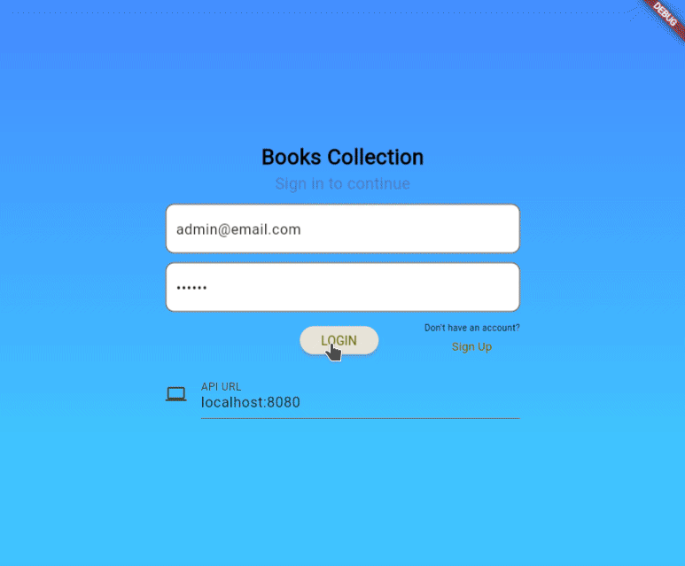
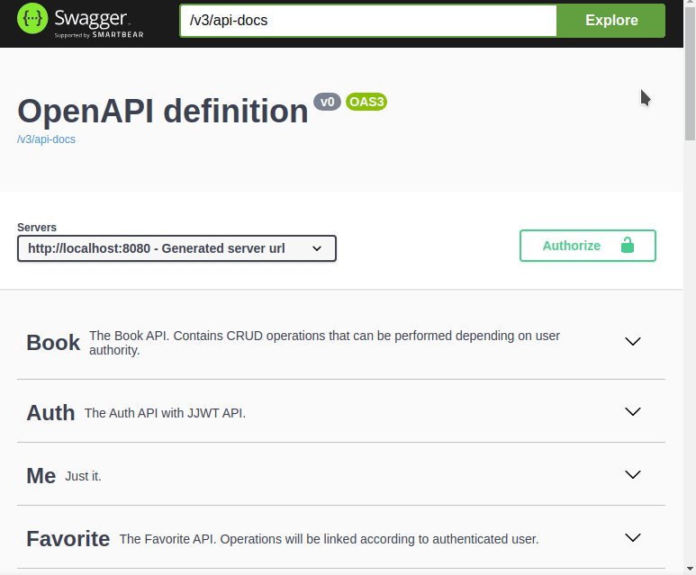

## Books Collection
Spring/Java project with the generic but functional premise of a PDF aggregator.

Frontend (flutter)           |  Docs (backend)
:-------------------------:|:-------------------------:
  |  

It was originally created in order to practice subjects like **SOLID, Clean Code/Architecture**, besides getting to know the **Spring ecosystem** as well.

Trying to avoid doing a simple CRUD as much as possible, it was also implemented:
- Authentication/Authorization with JJWT API and Spring Security.
- Database migration with Flyway.
- Validations and exceptions handling.
- Documentation with springdoc-openapi
- Extraction of PDF or images *[png, jpg/jpeg]* via URL.
- Upload of *.pdf* files.
- Human-Readable Format in local storage.

The front-end was made in **Flutter/Dart**, having as reference and initial inspiration this [project](https://github.com/MahmoudHesham099/Flutter-Web-Spring-boot-Ecommerce-Admin-Panel).

## Use
*'pg'* folder is the *postgresql+pgadmin* in *docker-compose* used during development and required for full backend functionality.   **Run *"docker-compose up -d"* inside the folder.**

After having the containers working, **access pgAdmin4 via *0.0.0.0:9876*,**  
**Add a new Server** where the hostname/address will be the name of the postgresql container (in this case **pgdb**) **port 5432.**  
With a successful connection, **create a new database called '*bkcollection*'**

Now we can run the application, for that we have two options:  
**Option 1**: Use the respective IDEs *(Spring Tool Suite and Android Studio)* to run the back/front end.  
**Option 2**: Run everything via terminal *(recommended)*:  
- backend: *"mvn spring-boot:run"*
- frontend: *"flutter run -d platform_name"*, where *platform_name* can be *windows, linux, chrome, web-server,* etc.

There are 3 initial users added via flyway migration with their respective authorities:  *[admin, librarian, client]@email.com*, where the password for all of them is *123456*.

In default settings, API documentation can be accessed at:  
http://localhost:8080/swagger-ui.html or http://localhost:8080/swagger-ui/index.html

### Is there anything to improve?
Will always have xD, for example:
- The human-readable format in local storage implementation is done at the cost of more database queries.
- Lack of animation between page transitions on the frontend.
- etc...
